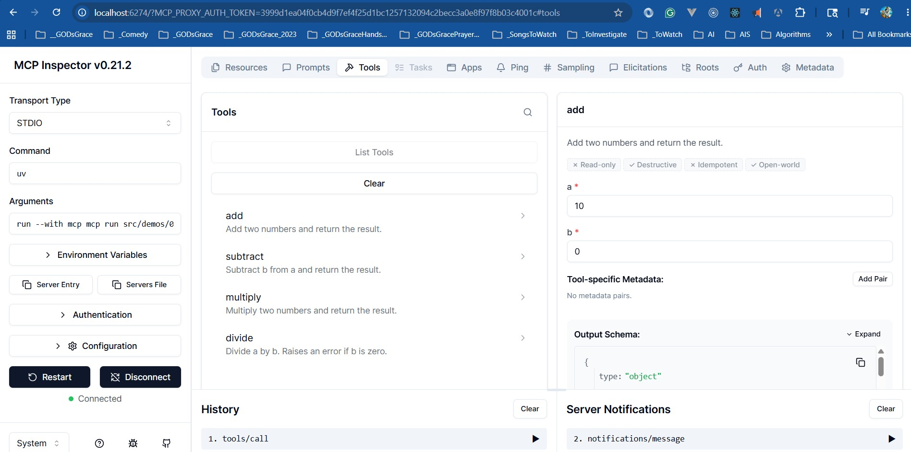

# Calculator Demo

A minimal MCP server and client using **FastMCP** — the high-level Python API
for building MCP servers with decorators.

## What this teaches

| Concept | Where |
| --- | --- |
| Server lifecycle (init → negotiate → serve) | `server.py` startup |
| Tool registration with type inference | `@mcp.tool()` decorators |
| Resource exposure | `@mcp.resource()` decorator |
| Prompt templates | `@mcp.prompt()` decorator |
| Transports (HTTP + stdio) | `config/settings.json` + `server.py --transport` |
| Client connection and tool calls | `client.py` (HTTP or `--stdio`) |

## Structure

```text
01-calculator/
├── server.py          # FastMCP server: 4 tools, 1 resource, 1 prompt
├── client.py          # Client: HTTP (default) or stdio (--stdio)
└── config/
    └── settings.json  # host, port, transport, server name
```

## Setup

Dependencies are managed at the repo root via `pyproject.toml`
(`mcp[cli]==1.27.1`). No separate install step is needed — `uv` resolves
everything automatically.

```bash
# From the repo root — install dependencies if not already done:
uv sync
```

## Run

Four ways to run the demo — pick the one that fits your workflow:

### Mode 1 — stdio, one terminal (client starts the server)

```bash
uv run python src/demos/01-calculator/client.py --stdio
```

The client spawns the server as a subprocess over stdio. No separate server
terminal needed.

### Mode 2 — HTTP, two terminals

**Terminal 1 — start the server** (serves on `http://127.0.0.1:8000/mcp`):

```bash
uv run python src/demos/01-calculator/server.py
```

**Terminal 2 — run the client:**

```bash
uv run python src/demos/01-calculator/client.py
```

If the client cannot reach the server, it prints hints to start it or switch
to `--stdio`.

### Mode 3 — MCP Inspector via stdio (interactive browser UI)

```bash
uv run mcp dev src/demos/01-calculator/server.py
```

Opens `http://localhost:6274` — browse tools, resources, and prompts and call
them interactively from the browser.



**Use Transport Type: STDIO in the Inspector UI.** The other options
("Streamable HTTP", "SSE") require a separately running HTTP server and will
fail with the Inspector's default URL.

### Mode 4 — MCP Inspector via Streamable HTTP

**Terminal 1 — start the HTTP server:**

```bash
uv run python src/demos/01-calculator/server.py
```

**Terminal 2 — open the Inspector:**

```bash
uv run mcp dev src/demos/01-calculator/server.py
```

In the Inspector UI at `http://localhost:6274`:

1. Set **Transport Type** → `Streamable HTTP`
2. Set **URL** → `http://127.0.0.1:8000/mcp`
3. Click **Connect**

The Inspector will connect to the already-running HTTP server instead of
spawning a new stdio subprocess.

Host, port, and transport are read from `config/settings.json`.

## FastMCP vs low-level Server API

| Area | FastMCP | `mcp.server.Server` |
| --- | --- | --- |
| Tool definition | `@mcp.tool()` with inferred schema | Manual JSON Schema |
| Resource definition | `@mcp.resource` patterns on URIs | Manual registration |
| Prompt definition | `@mcp.prompt()` | Manual registration |
| Transport | `mcp.run(transport=...)` | `stdio_server(app)` / custom |
| Best for | Learning, rapid prototyping | Fine-grained control |

## Tools exposed

| Tool | Inputs | Description |
| --- | --- | --- |
| `add` | `a`, `b` (float) | Returns a + b |
| `subtract` | `a`, `b` (float) | Returns a − b |
| `multiply` | `a`, `b` (float) | Returns a × b |
| `divide` | `a`, `b` (float) | Returns a ÷ b; errors if b = 0 |

## Resource and Prompt

- **`calculation://help`** — plain-text reference guide for the tools
- **`evaluate(expression)`** — generates a prompt asking the model to solve an
  expression using only the calculator tools
