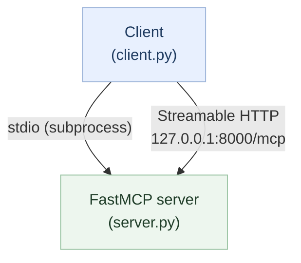
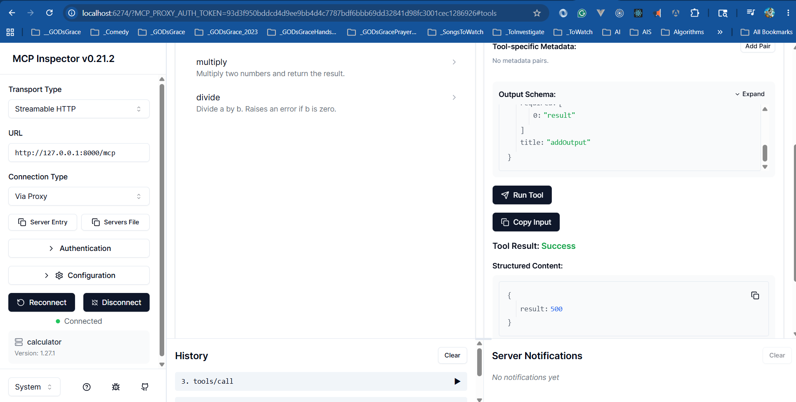

# Calculator Demo

A minimal MCP server and client using **FastMCP** — the high-level Python API
for building MCP servers with decorators.

## What this teaches

| Concept | Where |
| --- | --- |
| Server lifecycle (init → negotiate → serve) | `server.py` startup |
| Tool registration with type inference | `@mcp.tool()` decorators |
| Resource exposure | `@mcp.resource()` decorator |
| Prompt templates | `@mcp.prompt()` decorator |
| Transports (HTTP + stdio) | `config/settings.json` + `server.py --transport` |
| Client connection and tool calls | `client.py` (HTTP or `--stdio`) |

## Structure

```text
01-calculator/
├── server.py          # FastMCP server: 4 tools, 1 resource, 1 prompt
├── client.py          # Client: HTTP (default) or stdio (--stdio)
├── settings.py        # Shared loader for config/settings.json (server + client)
└── config/
    └── settings.json  # host, port, transport, server name
```

## Topology (dual transport)

The same FastMCP tool logic runs over **stdio** or **Streamable HTTP** — only the wire changes.



## Setup

Dependencies are managed at the repo root via `pyproject.toml`
(`mcp[cli]==1.27.1`). No separate install step is needed — `uv` resolves
everything automatically.

```bash
# From the repo root — install dependencies if not already done:
uv sync
```

## Run

Four ways to run the demo — pick the one that fits your workflow:

> [!IMPORTANT]
> For **Streamable HTTP**, start the HTTP server **before** connecting from the
> MCP Inspector or HTTP client.
>
> If the server is not already running, you will get:
>
> `ECONNREFUSED 127.0.0.1:8000`

### Mode 1 — stdio, one terminal (client starts the server)

```bash
uv run python src/demos/01-calculator/client.py --stdio
```

The client spawns the server as a subprocess over stdio. No separate server
terminal needed.

### Mode 2 — HTTP, two terminals

**Terminal 1 — start the server** (serves on `http://127.0.0.1:8000/mcp`):

```bash
uv run python src/demos/01-calculator/server.py
```

**Terminal 2 — run the client:**

```bash
uv run python src/demos/01-calculator/client.py
```

If the client cannot reach the server, it prints hints to start it or switch
to `--stdio`.

### Mode 3 — MCP Inspector via stdio (interactive browser UI)

```bash
uv run mcp dev src/demos/01-calculator/server.py
```

Opens `http://localhost:6274` — browse tools, resources, and prompts and call
them interactively from the browser.


**Use Transport Type: STDIO in the Inspector UI.** The other options
("Streamable HTTP", "SSE") require a separately running HTTP server and will
fail with the Inspector's default URL.

### Mode 4 — MCP Inspector via Streamable HTTP

**Terminal 1 — start the HTTP server:**

```bash
uv run python src/demos/01-calculator/server.py
```

Wait until you see `Uvicorn running on http://127.0.0.1:8000`.

**Terminal 2 — open the Inspector:**

```bash
uv run mcp dev src/demos/01-calculator/server.py
```

In the Inspector UI at `http://localhost:6274`:

1. Set **Transport Type** → `Streamable HTTP`
2. Set **URL** → `http://127.0.0.1:8000/mcp`
3. Set **Connection Type** → `Proxy` (routes through the Inspector's proxy,
   avoiding browser CORS restrictions)
4. Click **Connect**

The Inspector proxy makes the request server-side, so the browser CORS
restriction does not apply. The server must be running before you click
Connect — `ECONNREFUSED` means the server in Terminal 1 is not up yet.

### Quick failure signal guide

- `Created server transport` / `Created StreamableHttp client transport` means
  the Inspector and proxy started correctly.
- `connect ECONNREFUSED 127.0.0.1:8000` means the FastMCP HTTP server is not
  reachable yet (usually not started, or not listening on that host/port).



Host, port, and transport are read from `config/settings.json`.

## FastMCP vs low-level Server API

| Area | FastMCP | `mcp.server.Server` |
| --- | --- | --- |
| Tool definition | `@mcp.tool()` with inferred schema | Manual JSON Schema |
| Resource definition | `@mcp.resource` patterns on URIs | Manual registration |
| Prompt definition | `@mcp.prompt()` | Manual registration |
| Transport | `mcp.run(transport=...)` | `stdio_server(app)` / custom |
| Best for | Learning, rapid prototyping | Fine-grained control |

## Tools exposed

| Tool | Inputs | Description |
| --- | --- | --- |
| `add` | `a`, `b` (float) | Returns a + b |
| `subtract` | `a`, `b` (float) | Returns a − b |
| `multiply` | `a`, `b` (float) | Returns a × b |
| `divide` | `a`, `b` (float) | Returns a ÷ b; errors if b = 0 |

## Automated tests

`tests/demos/test_01_calculator.py` checks `settings.load_config()`, the tool callables (`add`
through `divide`, including division by zero), `calculation_help()`, and `evaluate()`. No server
process is started — FastMCP keeps the underlying Python functions callable.

From the repo root (with dev dependencies: `uv sync --all-groups`):

```bash
uv run pytest tests/demos/test_01_calculator.py -q
```

## Resource and Prompt

- **`calculation://help`** — plain-text reference guide for the tools
- **`evaluate(expression)`** — generates a prompt asking the model to solve an
  expression using only the calculator tools

## What's next

For **Pydantic** models, validation, and richer tool metadata,
continue with [typed calculator Demo 02](../02-typed-calculator/README.md).

It listens on port `8001` and keeps the same transports and client layout as
this demo.
